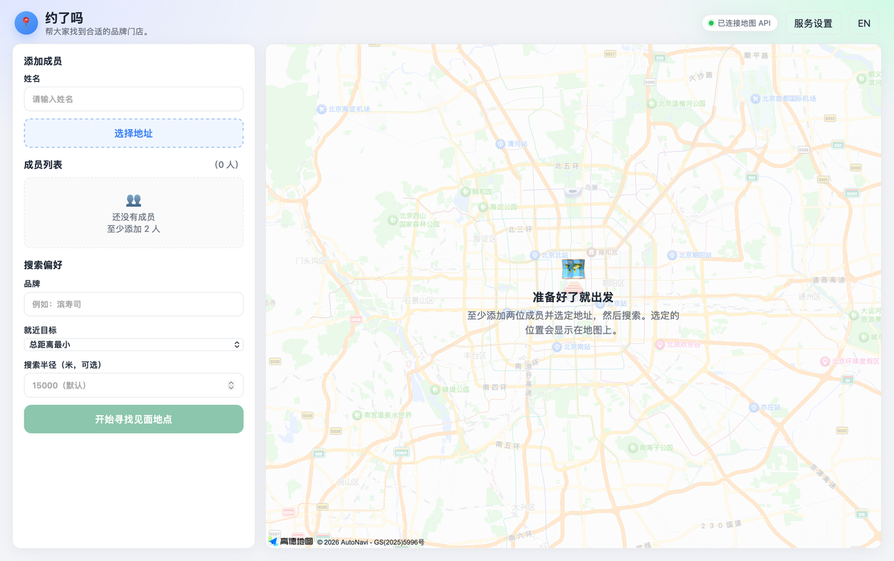

# MeetingSearch _(meeting-search)_



[](https://github.com/RichardLitt/standard-readme)

帮一群人找到最适合碰面的品牌门店：按真实驾车距离，给附近所有分店排序。

周末约饭、同学聚会、见客户……只要大家不在同一个地方，选店就是件麻烦事。打开地图一家家比，要么凭感觉，要么只照顾了离得近的人。MeetingSearch 把这个问题变成一次简单的搜索：填上每个人的位置，选一家品牌（比如 滨寿司），它就会找出附近所有分店，用真实的驾车路程计算每个人到每家店的距离，最后按你选的目标给出排名和推荐门店。

它是一个运行在你自己电脑上的本地网页工具（界面是中文的），不需要注册账号，不依赖任何框架。没有地图密钥也能先跑起来，用内置的演示数据体验完整流程。

## 目录

- [安全须知](#安全须知)
- [背景](#背景)
- [安装](#安装)
- [使用](#使用)
- [功能一览](#功能一览)
- [常见问题](#常见问题)
- [API](#api)
- [维护者](#维护者)
- [致谢](#致谢)
- [贡献](#贡献)
- [许可](#许可)

## 安全须知

- 这个工具没有登录功能，任何能访问到这台电脑上服务的人都可以修改配置。请只在本地运行，**不要部署到公网或共享给局域网**。
- 高德密钥保存在本地 `.env` 文件中（已被 git 忽略），不要把 `.env` 或真实密钥提交、分享出去。
- 网页地图会用到 JS 密钥，建议在高德控制台里配置域名白名单，限制只能在你自己的页面上使用。

## 背景

选碰面地点的难点在于“距离”不是直觉上的直线。两个人隔得近，第三个人可能要跨半个城；同一家品牌在不同位置的店，对每个人的路程也完全不同。手动比较几家店的路程又慢又容易算错，所以这个项目用数据替你做这件事：真实驾车距离、每位成员到每家店的距离、按目标排序。

项目依赖很少：需要 Node.js（18 或更高版本，建议用 LTS）；真实数据来自高德开放平台，可选配置地理编码 / POI 搜索 / 驾车距离所需的 Web 服务密钥，以及网页地图所需的 JS API 密钥。

## 安装

先安装 Node.js：到 [nodejs.org](https://nodejs.org) 下载 LTS 版本并安装。

然后获取代码并安装依赖：

```bash
git clone https://github.com/starumiQAQ/MeetingSearch.git
cd MeetingSearch
npm install
```

不想用 git 的话，也可以在 GitHub 页面点击 **Code → Download ZIP**，解压后进入 `MeetingSearch` 目录执行上面的 `npm install`。

## 使用

启动服务：

```bash
npm start
```

浏览器打开 <http://localhost:3000>，按下面的步骤操作：

1. **添加成员**：在顶部输入姓名和大致地址（比如“望京”），点「搜索」。
2. **确认地址**：如果地址有多个同名地点，选择正确的那个；只有一个结果时会自动确认。
3. **填品牌和范围**：输入想去的品牌（比如“滨寿司”），搜索半径默认 15 公里。
4. **选目标**：在「就近目标」里二选一——
   - **总距离最小**：所有人开车路程加起来最短；
   - **最远人最小**：让离得最远的那个人路程尽量短。
5. **查看结果**：点「开始寻找见面地点」，页面会按目标给出排名，第一名就是推荐门店，还可以在地图上看到每个成员的位置和门店位置。

没配置高德密钥时，应用会自动进入演示模式：内置了北京的示例门店和几个预设地址，可以完整体验流程，不会产生任何网络请求。

### 配置真实地图（可选）

想要真实的门店数据和驾车距离，需要申请高德密钥（[高德开放平台](https://lbs.amap.com/)）。申请后点击页面顶部的**「服务设置」**，填入密钥即可，不需要重启服务。

也可以直接把密钥写进 `.env` 文件（参考 [`.env.example`](./.env.example)）：

| 变量 | 必填 | 默认值 | 作用 |
|---|---|---|---|
| `AMAP_KEY` | 使用真实数据时 | — | 高德 Web 服务密钥：地址解析、门店搜索、驾车距离 |
| `AMAP_QPS` | 可选 | `3` | 每秒最多请求高德多少次（个人密钥常见限制） |
| `AMAP_JS_KEY` | 可选 | 同 `AMAP_KEY` | 网页地图用的 JS API 密钥 |
| `AMAP_SECURITY_JS_CODE` | 可选 | — | JS 密钥的安全码（2021-12-02 之后创建的密钥需要） |
| `PORT` | 可选 | `3000` | 服务端口 |

修改地图相关密钥后，刷新一下页面即可生效。

## 功能一览

- **地址自动解析**：输入自由文本地址，自动转换成地图坐标；同名地点让你手动确认。
- **两种排序目标**：总路程最短、最远的人不吃亏。
- **真实驾车距离**：按驾车路线长度计算，而不是直线距离。
- **完整排名**：不只给一个答案，而是列出所有候选门店及每个人的路程。
- **地图展示**：配置密钥后，网页上直接显示参与者、候选门店和推荐结果。
- **演示模式**：零配置开箱即用，内置示例数据，无需联网。
- **热更新配置**：在界面里改密钥即时生效，不用重启。

## 常见问题

**不填密钥能用吗？**

能。没有密钥时自动使用演示模式，数据和距离都是内置示例，适合先体验流程。

**为什么输入地址后要我选一个？**

地址可能有多个同名地点（比如“望京”可能指街道、小区等）。为了结果准确，应用会让你选正确的那个；只有一个结果时会自动确认。

**结果准确吗？**

门店搜索和距离计算来自高德地图的真实数据，距离是驾车路线长度。注意距离会受路况、单行道等因素影响，推荐结果更适合作为参考。

**可以多人同时用吗？**

目前是本地单机工具，适合组织者在一台电脑上操作，然后把结果分享给其他人。

## API

面向开发者的 HTTP 接口文档见 [docs/api.md](./docs/api.md)，包含 `/api/geocode`、`/api/search` 和 `/api/service-settings` 的请求、响应与错误说明。

## 维护者

- [starumiQAQ](https://github.com/starumiQAQ)

## 致谢

- [高德开放平台](https://lbs.amap.com/)：提供地理编码、周边 POI 搜索和驾车路线距离服务。

## 贡献

欢迎通过 [GitHub Issues](https://github.com/starumiQAQ/MeetingSearch/issues) 提问、报 bug 或提建议，也欢迎提交 Pull Request。

开发流程、测试命令和提交规范见 [CONTRIBUTING.md](./CONTRIBUTING.md)；领域术语（Participant、Brand、Branch、Ranking 等）以 [CONTEXT.md](./CONTEXT.md) 为准，写 issue 和 PR 时请使用这些词汇。

## 许可

本项目以 [MIT 许可证](./LICENSE) 开源，版权所有（c）2026 starumiQAQ。你可以自由使用、修改和分发，具体条款见 [LICENSE](./LICENSE) 文件。
